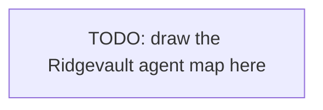

# Ridgevault Financial — multi-agent architecture

## Purpose

Whiteboard-quality diagram of Ridgevault's five specialist agents plus the Ridge
Orchestrator, showing tool ownership boundaries and A2A / MCP edges. This file
is the artifact Ridgevault reviews before opening the first pull request.

## Diagram

<!-- TODO (exercise 2): replace the placeholder with a Mermaid `graph TD` (or `flowchart LR`)
diagram of the five specialist agents (Portfolio Analyst, Compliance Officer, Risk Assessor,
Client Relations, Investment Researcher) plus the Ridge Orchestrator. Show tool ownership as
child nodes of each agent, and label agent-to-agent edges with the protocol (A2A) and
agent-to-tool edges with the protocol (MCP). Use the tool inventory from the L1 teaching lab
(agent map, Topic 3) as your source of truth. -->

## Legend

- Solid edges labelled `A2A`  — reasoning peers (agent-to-agent).
- Dashed edges labelled `MCP` — tool execution (agent-to-tool).
- Human icon                  — human-in-the-loop checkpoint.

## Notes

- The Ridge Orchestrator owns **zero domain tools** on purpose — its job is to plan and route.
- `restriction_check` is owned exclusively by Ridge Compliance (see ADR-014 in the L1 notes);
  Ridge Analyst calls Compliance via A2A, not the tool directly.
- HITL checkpoints (Topic 5 of L1) are not on this diagram — add them once the mesh is in place.
