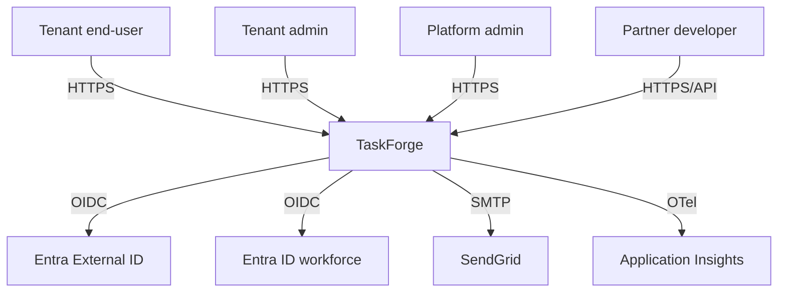

# TaskForge Architecture

## 1. Context (C4 L1)

## 2. Containers (C4 L2)

- Blazor Server Web (App Service)
- Admin Razor Pages (App Service)
- Public API minimal-API (App Service, behind APIM)
- Function App (isolated .NET 10; SB triggers + Durable)
- Azure SQL (tenant metadata)
- Cosmos DB (task documents)
- Service Bus (commands + events)
- APIM v2 Standard (public API surface)
- Key Vault
- App Configuration
- Log Analytics + App Insights

## 3. Components — Blazor Server internal (C4 L3)

_(fill in — Pages, Services, DbContext, HttpClients, SignalR hub client)_

## 4. Service-selection matrix

| Layer | Choice | Why-not-alternative | Cost note | Risk |
|---|---|---|---|---|
| Web compute | App Service S1 | Container Apps: no first-class slot swap | ~$220/mo (3× S1) | If S1 exhausted, upgrade to P1v3 |
| ... | | | | |

## 5. Cost model at 10k tenants

| Line item | SKU | Assumption | $/mo |
|---|---|---|---|
| App Service plan | S1 × 3 | Always-on | 220 |
| ... | | | |
| **Total** | | | **~$3,000** |

## 6. Risk log

| # | Risk | Likelihood | Impact | Mitigation |
|---|---|---|---|---|
| 1 | Cross-tenant data leak | Low | Existential | RLS + hierarchical PK + JWT tid check (M3, M4) |
| 2 | Region failure | Medium | High | Paired-region DR runbook (M10) |
| 3 | Cost overrun | Medium | Medium | LAW daily cap + budget alerts |
| 4 | Partner API break | High | Medium | Path-based versioning + long deprecation windows |
